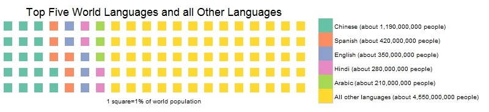

*For R users not interested in the post but the code, a markdown file is available on github.  Thanks to Zuguang Gu and Bob Rudis for the 'circlize' and 'waffle' packages respectively.

I've been studying Arabic for about 10 months now and had some thoughts that I wanted to post about.  It's challenging, but I didn't know how challenging it was exactly when compared to other languages even though I knew it was on the more challenging end of the spectrum.  Turns out someone has measured (or attempted to) the amount of "class time" a native English speaker would need in order to learn a language.  In general, I've found my language ability improves most when I complement time in the classroom with time practicing with native speakers (which I think would be a more useful measure of time in tandem with "class time").

The data for the chord diagram below was retrieved from a language wiki site that used a study from the Foreign Service Institute.  The number of class hours for each of these languages communicates more a scale of difficulty than the exact number of hours it would take to speak a language (as not all learners are equal).  In general, this seemed to be a pretty comprehensive list of world languages so I thought it could look nice in a chord diagram.

From my own experience, I've been studying for about 10 months.  Not intensively perse, but about 6 hours per week along with conversation practice I have on my own.  Which means if I miss a few weeks I'll have logged about 300 class hours at a year.  Which is kind of disappointing considering I supposedly need 2,200 class hours!  I think these numbers are actually REALLY conservative but it does set some sort of benchmark for difficulty when comparing languages for English speakers.  I'm conversational now and feel comfortable with the language (though by no means fluent) after about 300 hours.  Which as a side note is why I think being immersed would decrease the amount of class time above dramatically.  

So, in learning Arabic and spending a supposed 2,200 hours studying it, how many more people can I actually communicate with?  Well, a lot more.  But in terms of world population I was surprised at the percentage of people who accounted for the top 5 most spoken languages (this includes Arabic).  I honestly had no idea language was quite this diverse (in that the top 5 languages comprise 35% of the world's languages, thought it would be more but that's just me).  Furthermore, if we get into dialects these percentages decrease further.  

