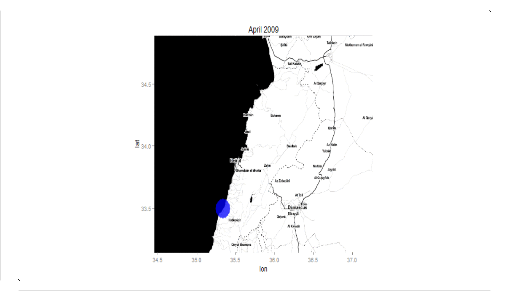

This is an animation of the growth in Syrian refugee informal camp settlements in Lebanon over the past several years.  You can see from the .gif that the growth was most dramatic in terms of the number of settlements in the Summer of 2013.  The border has recently been closed and the number of additional settlements you can tell has dramatically decreased (opening in new window may be better for viewing).   

This was inspired by a much cooler animation by Nathan Yau of [Walmart/Sams club store locations](http://projects.flowingdata.com/walmart/) over time.  But this was my best attempt using what I knew in R, [code here](https://github.com/justlebeau/Blog-Code/blob/master/RefugeeHTML).  Special thanks to Kay Cichini for his helpful examples/tips and Yihui Xie for creating the awesome 'animation' package.

